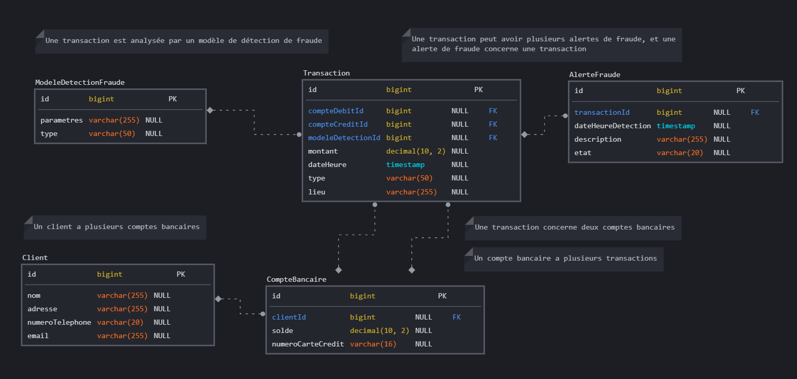

# Fraude-detective
Détection de fraude dans les paiements en ligne

## Modèle de Données


## Script SQL
```sql
CREATE TABLE Client (
    id BIGINT PRIMARY KEY,
    nom VARCHAR(255),
    adresse VARCHAR(255),
    numeroTelephone VARCHAR(20),
    email VARCHAR(255)
);

CREATE TABLE CompteBancaire (
    id BIGINT PRIMARY KEY,
    clientId BIGINT,
    solde DECIMAL(10, 2),
    numeroCarteCredit VARCHAR(16),
    FOREIGN KEY (clientId) REFERENCES Client(id)
);

CREATE TABLE Transaction (
    id BIGINT PRIMARY KEY,
    compteDebitId BIGINT,
    compteCreditId BIGINT,
    montant DECIMAL(10, 2),
    dateHeure TIMESTAMP,
    type VARCHAR(50),
    lieu VARCHAR(255),
    modeleDetectionId bigint,
    FOREIGN KEY (compteDebitId) REFERENCES CompteBancaire(id),
    FOREIGN KEY (compteCreditId) REFERENCES CompteBancaire(id),
    FOREIGN KEY (modeleDetectionId) REFERENCES ModeleDetectionFraude (id)
);

CREATE TABLE AlerteFraude (
    id BIGINT PRIMARY KEY,
    transactionId BIGINT,
    dateHeureDetection TIMESTAMP,
    description VARCHAR(255),
    etat VARCHAR(20),
    FOREIGN KEY (transactionId) REFERENCES Transaction(id)
);

CREATE TABLE ModeleDetectionFraude (
    id BIGINT PRIMARY KEY,
    parametres VARCHAR(255),
    type VARCHAR(50)
);
```
## Outils 
